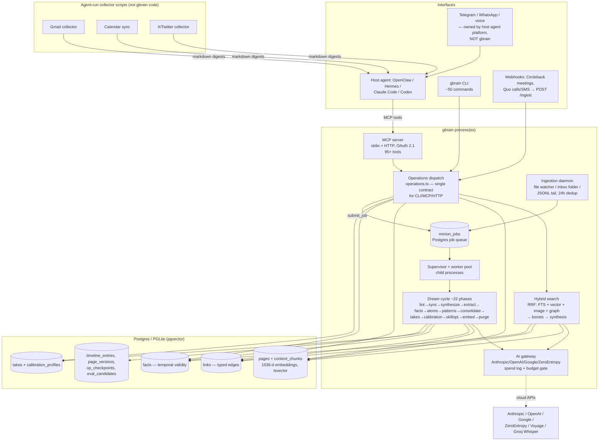

# GBrain Architectural Analysis

**Repo:** https://github.com/garrytan/gbrain
**Commit analyzed:** `03ffc6ebdbc7dd8b29e5bfd0c3a9a6c983b54f01` (tag v0.42.37.0, 2026-06-09; package.json reports 0.42.38.0)
**Local clone:** `/tmp/gbrain-analysis` (all file:line refs below are repo-relative to that clone)
**Scale:** ~1,880 TypeScript files, ~12.8k lines across the five core hot files alone, 56 skills, 95+ MCP operations, 75+ DB migrations. This is Garry Tan's production system (claims 146k pages, 24.5k people, 5.3k companies, 66 cron jobs).

---

## 0. TL;DR — the one framing that matters

**GBrain is not an agent. It is a memory engine + maintenance daemon that a host agent plugs into.** The "agent" in Garry's setup is OpenClaw (or Hermes, Claude Code, Codex) talking to gbrain over MCP. GBrain owns: storage, hybrid retrieval, the knowledge graph, fact extraction, the nightly "dream cycle," a Postgres-native job queue, and a skills library written as markdown instructions *for the host agent to follow*. It does **not** own: the chat interface, the conversational loop, tool-use planning, or most ingestion connectors (email/calendar/Twitter fetching is done by agent-run collector scripts, not gbrain code).

For your project this is the single most valuable architectural lesson: **separate the brain (durable, deterministic, testable) from the agent (LLM loop, replaceable)**, and connect them with a stable contract (MCP). That's also exactly the seam where Letta sits, so the two are more comparable than the README suggests — Letta is agent-first with memory inside; gbrain is memory-first with the agent outside.

---

## 1. Overall architecture

### Components

| Component | What it is | Where |
|---|---|---|
| **BrainEngine** | Storage abstraction over Postgres (pgvector) or PGLite (embedded, zero-server) | `src/core/engine.ts`, `src/core/postgres-engine.ts`, `src/core/pglite-engine.ts`, `src/core/engine-factory.ts` |
| **Operations layer** | ~95 operations, single source of truth for CLI + MCP + HTTP. Contract-first: every surface dispatches through the same `OperationContext` | `src/core/operations.ts` (4,892 lines), `src/mcp/dispatch.ts` |
| **MCP server** | stdio + HTTP transports, OAuth 2.1 / bearer tokens, rate limiting | `src/mcp/server.ts`, `src/mcp/http-transport.ts`, `src/core/oauth-provider.ts` |
| **Hybrid search** | RRF fusion of keyword (FTS) + vector (HNSW) + optional image + optional graph-relational arms | `src/core/search/hybrid.ts` (1,968 lines) |
| **Dream cycle** | ~22-phase nightly maintenance pipeline (sync → extract → facts → patterns → consolidate → takes → embed → purge) | `src/core/cycle.ts` (2,377 lines), `src/commands/dream.ts` |
| **Autopilot** | Daemon that schedules dream cycles via the job queue, per-source fanout, self-upgrade | `src/commands/autopilot.ts`, `src/commands/autopilot-fanout.ts` |
| **Minions** | Postgres-native durable job queue + supervisor + worker child processes (BullMQ-shaped, no Redis) | `src/core/minions/queue.ts`, `supervisor.ts`, `worker.ts`, 14 handlers |
| **AI gateway** | All LLM/embedding calls routed through one gateway (Vercel AI SDK multi-provider), with spend log + daily budget gate | `src/core/ai/gateway.ts`, `src/core/model-config.ts`, `src/core/budget/` |
| **Ingestion daemon** | Supervised pluggable sources (file watcher, inbox folder, JSONL tail) with dedup + rate limits + health probes | `src/core/ingestion/daemon.ts`, `src/core/ingestion/sources/` |
| **Skills library** | 56 markdown SKILL.md files — prose workflows the *host agent* executes (ingest, query, enrich, meeting-ingestion, skill-creator…) | `skills/`, `skills/manifest.json` |
| **Admin SPA** | React dashboard: live request feed, OAuth clients, job watch, calibration scorecards | `admin/src/pages/` |
| **Host-agent glue** | OpenClaw plugin + deterministic context engine that injects time/location/calendar into every agent turn | `openclaw.plugin.json`, `src/openclaw-context-engine.ts` |

### Data flow

Two long-running loops: (1) the **host agent's conversational loop** (outside gbrain) calling MCP tools per turn, and (2) **autopilot → minion queue → dream cycle** running maintenance continuously/nightly. Disk markdown is the system of record; the DB is a derived index that `sync` reconciles (`docs/architecture/system-of-record.md`).

---

## 2. Stack

- **Language/runtime:** TypeScript on **Bun** (compiled to single binaries via `bun build --compile`; `package.json:36`).
- **Frameworks:** Express 5 (HTTP/MCP/admin), React (admin SPA), `@modelcontextprotocol/sdk` 1.29, **Vercel AI SDK** (`ai` v6 + `@ai-sdk/anthropic|openai|google|openai-compatible`) for provider-agnostic LLM calls.
- **LLM providers:** Anthropic-first. Tier defaults in `src/core/model-config.ts`: chat = `claude-sonnet-4-6`, expansion/cheap-judge = `claude-haiku-4-5`, skill optimization = Opus. Multi-judge ensembles can pull GPT-4o + Gemini. Embeddings: OpenAI `text-embedding-3-large` (1536-d) historically, default migrating to **ZeroEntropy zembed-1** (1280-d Matryoshka, cited 2.6× cheaper); **Voyage multimodal** (1024-d) for images. STT: **Groq Whisper** default, OpenAI Whisper fallback, Deepgram optional (`src/core/transcription.ts`).
- **Database:** Postgres + **pgvector** (HNSW) for production; **PGLite** (embedded WASM Postgres) for zero-install local brains. Same schema both ways (`src/schema.sql`, 1,373 lines; `src/core/pglite-schema.ts`).
- **Queue:** **No Redis.** A Postgres-native job queue (`minion_jobs`, `src/schema.sql:805`) with leases, exponential backoff + jitter, idempotency keys, parent-child job trees, stall detection, quiet-hours, and token-usage accounting columns.
- **Other:** chokidar (file watching), tree-sitter WASM (code-aware chunking + call graph), gray-matter (frontmatter), S3 client (file storage), zod.

---

## 3. Memory design

This is the strongest part of the codebase. Four distinct memory layers, each with different write/read mechanics:

### 3.1 Pages (episodic + semantic documents)

`pages` table (`src/schema.sql:85-153`): `slug`, `type`, `title`, **`compiled_truth`** (the canonical synthesized body), `timeline`, `frontmatter` JSONB, `content_hash`, **`emotional_weight`** (0–1 salience score, recomputed by a cycle phase), `effective_date` + `effective_date_source` (provenance), `last_retrieved_at` (staleness signal), `deleted_at` (soft delete, 72h recovery), per-row `generation` counter + global `page_generation_clock` (`src/schema.sql:218`) for cache invalidation. FTS trigger builds a weighted tsvector (A=title, B=compiled_truth, C=timeline).

The **compiled_truth vs timeline** split is a deliberate epistemic design: timeline = append-only raw evidence with dates; compiled_truth = the current synthesized understanding, rewritten by consolidation. Search boosts compiled_truth chunks 2.0× (`src/core/search/hybrid.ts:48`).

### 3.2 Chunks + embeddings

`content_chunks` (`src/schema.sql:279-312`): chunk text, `embedding vector(1536)` (HNSW cosine), per-chunk tsvector, plus code-intel columns (symbol_name, start/end_line, parent_symbol_path from tree-sitter) and multimodal columns (`embedding_image`, `embedding_multimodal`, both 1024-d).

- **Semantic chunking** (`src/core/chunkers/semantic.ts`): ~300 words / 50 overlap, but boundaries found by embedding adjacent sentences, smoothing cosine similarity with Savitzky-Golay, and splitting at local minima. Recursive fallback.
- **Contextual retrieval** (Anthropic-style, `src/core/contextual-retrieval-service.ts`): each chunk embedded with a `<context>{title}\n{haiku synopsis}</context>\n{chunk}` prefix; three tiers (`title` → `title_and_summary` → `per_chunk_synopsis`); **two-phase commit** — all chunks built in memory first, single DB transaction second, with whole-page restart at a lower tier on any LLM refusal. A `corpus_generation` hash (prompt version | wrapper version | model) stamps every page so model/prompt changes trigger targeted re-embeds.

### 3.3 Knowledge graph (zero-LLM)

`links` table (`src/schema.sql:438`) holds typed edges with provenance (`link_source`: markdown / frontmatter / wikilink-resolved / manual; `link_type`: works_at, invested_in, founded, attended, advises, mentions…). Extraction (`src/core/link-extraction.ts:97-162`) is **pure regex** over markdown links and `[[wikilinks]]` (including source-qualified `[[source:slug]]`), with code-fence masking. The graph is "self-wiring" because the *skills force the host agent to write links*: every ingestion skill mandates entity pages + backlinks ("Iron Law" in `skills/ingest/SKILL.md`). Graph traversal (`engine.traversePaths`, surfaced as `traverse_graph` MCP tool and `gbrain graph-query`) supports type/direction/depth filters, and since v0.40.4 a **relational-recall arm feeds graph neighbors into RRF fusion at query time**. Benchmarked claim: +31.4 points P@5 over the graph-disabled variant.

### 3.4 Facts (hot memory) + temporal modeling

Facts are atomic rows (kind ∈ event/preference/commitment/belief/fact) with `valid_from`/`valid_until`, `superseded_by`, `confidence`, `visibility` (private/world), notability, provenance (`source`: `mcp:put_page` / `cli:think` / `fence:reconcile`), and their own embeddings (`src/core/engine.ts:452-527`, extraction in `src/core/facts/extract.ts` via Haiku, ≤10 facts/turn). Exposed as MCP tools `extract_facts` / `recall` / `forget_fact`.

The killer detail: facts round-trip through a **human-editable `## Facts` markdown fence** on the entity page (`src/core/facts-fence.ts`). Strike through a line in your editor → next reconcile sets `valid_until = today`. Memory editing = text editing. Same pattern for `## Takes`.

**Temporal:** `effective_date` precedence chain (`src/core/effective-date.ts:8-14`): `frontmatter.event_date` > `date` > `published` > filename `YYYY-MM-DD` > `updated_at`, with range validation (1990 → now+1y) and per-dir overrides for `daily/`, `meetings/`. Plus contradiction probes (Haiku pairwise judge with verdict cache + TTL, `eval_contradictions_cache`) and `find_trajectory` (typed numeric claims over time → regression/drift detection).

### 3.5 Retrieval pipeline (hybrid search)

`src/core/search/hybrid.ts`: BM25 arm + vector arm (+ image arm + relational arm) → **RRF fusion (K=60**, `hybrid.ts:47`) → normalize → boosts (compiled_truth 2.0×; backlink boost `1 + 0.05·log(1+count)`, `hybrid.ts:132`; salience; per-prefix recency decay) → 0.7·RRF + 0.3·cosine re-blend → per-page dedup. **Query intent classification is regex, not LLM** (`src/core/search/query-intent.ts`: temporal/entity/event/general patterns set arm weights, detail, recency). Optional LLM query expansion (Haiku), autocut, and a 3-layer query cache gated on the page generation clock. Answer **synthesis** (`think`, `src/core/think/index.ts`) gathers via hybrid search + graph anchor, generates cited prose, and **explicitly flags gaps** ("nothing added about Alice since April 22").

---

## 4. Ingestion

Critical distinction the README hides: **most "ingestion" is not gbrain code — it's the host agent following skill instructions, with deterministic collector scripts for the mechanical parts.**

### First-party (in gbrain, `src/core/ingestion/`)
- **IngestionDaemon** (`daemon.ts`): supervises pluggable `IngestionSource`s — per-source crash counters w/ backoff (max 10), 24h content-hash dedup window, token-bucket rate limit (100 events/10s), health probes for `gbrain doctor`.
- **FileWatcherSource** (`sources/file-watcher.ts`): chokidar over the brain repo's markdown, 1s debounce, atomic-write awareness.
- **InboxFolderSource** (`sources/inbox-folder.ts`): watches `~/.gbrain/inbox/` (iOS Shortcuts / AirDrop / Drafts drop target), archives processed files to `.archived/YYYY-MM-DD/`.
- **Webhook endpoint**: OAuth-gated `POST /ingest` on the HTTP server (text-only allowlist, 1MB cap, marks payloads `untrusted_payload: true`, enqueues `ingest_capture` minion jobs) — deliberately lives in the server, not the daemon.
- **Bulk import**: `gbrain import` with path-based checkpoints (`src/core/import-checkpoint.ts`), parallel workers, content-hash idempotency.
- **Transcription** (`src/core/transcription.ts`): Groq/OpenAI Whisper, >25MB ffmpeg segmentation; speaker field optional (no real diarization).
- **Conversation parser** (`src/core/conversation-parser/`): regex pattern bank for iMessage/Slack/Telegram/Discord/WhatsApp/Zoom exports, scored against the first 10 lines, LLM fallback only when zero patterns match (the "deterministic-first, LLM-fallback" pattern — `src/core/fail-improve.ts`).
- **Skillpack sources**: third-party connectors loadable from manifests (`src/core/ingestion/skillpack-load.ts`), TOFU trust model, isolation "planned for v2" (i.e., none today).

### Host-agent-driven (recipes + skills, not gbrain code)
- **Email** (Gmail API), **Calendar** (Google Calendar), **X/Twitter** (API v2): agent runs deterministic Node "collector" scripts that fetch and emit markdown digests; the LLM then does judgment work (enrichment, entity pages) via skills. The recipes explicitly say collectors are code **because LLMs kept failing at mechanical pagination/links**.
- **Meetings**: Circleback webhook (HMAC-verified) wakes the agent → agent pulls the API → `skills/meeting-ingestion` (mandatory attendee people-pages + backlinks). Quo/OpenPhone webhooks for calls/SMS.
- **Voice notes**: `skills/voice-note-ingest` — store raw audio (S3/Supabase), transcribe, route via a 7-branch decision tree (originals/ concepts/ people/ ideas/ personal/ …), **preserve exact phrasing in blockquotes**, cross-link every entity.
- Every ingest path funnels through filing rules (`skills/_brain-filing-rules.md`) and mandatory citation format `[Source: {context}, {date}]`.

---

## 5. Agent loop, reflection, self-improvement

### 5.1 The dream cycle (the actual "self-maintaining" part)

`src/core/cycle.ts:101-186` defines ~22 ordered phases. Highlights in execution order: `lint` → `backlinks` → `sync` (disk→DB) → `synthesize` (transcripts→pages via Sonnet subagent) → `extract` (links/chunks) → `extract_facts` (fence reconcile) → `extract_atoms` (Haiku) → `resolve_symbol_edges` → `patterns` (cross-session themes, Sonnet) → `synthesize_concepts` (atom dedup → tiered narratives) → `recompute_emotional_weight` → `consolidate` (fact clustering) → `propose_takes` → `grade_takes` → `calibration_profile` → `conversation_facts_backfill` → `enrich_thin` (stub pages get grounded synthesis) → `skillopt` → `embed` → `orphans` → `schema-suggest` → `purge`. Locking: per-source DB locks with 5-min TTL renewed in-phase; phases declare per-source vs global scope.

**Scheduling:** `gbrain dream` is a one-shot cron target (`0 2 * * *`). **Autopilot** (`src/commands/autopilot.ts`) is the daemon version: every ~60 min it enqueues `autopilot-cycle` jobs into the minion queue with slot-based idempotency keys (slow cycles never stack), with **per-source fanout** (default 4 parallel on Postgres, oldest-stale-first; `src/commands/autopilot-fanout.ts:36` `FULL_CYCLE_FLOOR_MIN = 60`). Failure classification splits unrecoverable (bad credentials → exit) from recoverable (network blip → backoff, cap 30). It even **self-upgrades** during quiet hours when idle (binary swap + supervisor relaunch with breadcrumbs).

### 5.2 Takes + calibration (the most original subsystem)

The brain extracts the *user's own predictions and judgments* ("takes") from prose (Sonnet extractor, tuned to F1 0.952), queues them for human review (gmail-style J/K CLI queue), then a judge model later grades resolved takes against outcomes. Results roll into per-holder **Brier scores and calibration curves** (`takes_scorecard`, `takes_calibration` MCP tools; `calibration_profiles` table at `src/schema.sql:1175`), then a Haiku-generated **bias profile gets injected back into synthesis** (`think --with-calibration`) as an anti-bias rewrite. The brain literally learns "you're overconfident about X" and corrects future answers. Auto-resolve is off by default; ensemble mode requires 3 judges to agree at ≥0.85 confidence.

### 5.3 Skill creation/optimization — weaker than advertised

- **Skills are markdown for the host agent** (YAML frontmatter: triggers, tools, mutating; body: contract/phases/anti-patterns). Routing = substring/trigger matching via `skills/RESOLVER.md`.
- **SkillOpt** (`src/core/skillopt/`, cycle phase, **off by default**): eval-driven text-space optimization of *existing* skill prompts — generates variants with Opus/Sonnet, gates on median-of-3 judge Brier with ε=0.05, cost-capped ($0.50/skill, $2/brain/cycle), and **never auto-mutates bundled skills** (emits `proposed.md` for review).
- **skill-creator / skillify** (`skills/skill-creator/SKILL.md`): a *workflow the agent follows when a human asks*, with a heavyweight 11-point conformance ladder (unit tests, evals, resolver entries, E2E). Not automatic.
- **What feeds future skills:** `src/core/fail-improve.ts` (deterministic-first/LLM-fallback executor logging every fallback to JSONL + generating candidate test cases) and the **friction protocol** (`src/core/friction.ts` — agents append structured confusion/blocker events to JSONL). These accumulate *evidence* of repeated behaviors, but **no code closes the loop from "repeated behavior observed" → "new skill drafted automatically."** A human or an explicitly-prompted agent must initiate skill creation.

### 5.4 Subagents / background reasoning

Minion `subagent` handler runs multi-turn LLM tool loops as durable jobs (with `subagent_messages` / `subagent_tool_executions` tables, depth caps, child caps, budgets) — so heavy reasoning (transcript synthesis, patterns) runs in the queue, not in the chat thread. `submit_agent` is exposed over MCP with OAuth-bound tool/source/budget limits.

---

## 6. Interfaces

- **Primary: MCP.** stdio for local agents (`claude mcp add gbrain -- gbrain serve`), HTTP with OAuth 2.1 + PKCE + DCR for cloud clients (ChatGPT, Perplexity, Claude Desktop). 95+ tools (full list in `src/core/operations.ts:4809-4888`). Per-token source isolation, takes-holder visibility filtering (private hunches hidden from remote callers by default), pre-auth + post-auth rate limiting.
- **CLI:** ~50 direct commands + all operations via `gbrain call`; thin-client mode routes a laptop CLI to a remote brain over MCP (`docs/architecture/thin-client.md`, `topologies.md`).
- **Admin SPA:** live SSE request feed, OAuth client management, job watch, calibration dashboards, server-rendered SVG charts (no chart lib).
- **Chat (Telegram/WhatsApp/etc.): not gbrain's job.** Entirely delegated to OpenClaw/Hermes. Zero Telegram code in the repo.
- **Voice:** `recipes/agent-voice/` — a reference WebRTC server + persona prompts + post-call skill, *copied into the host agent repo*, with a read-only tool allowlist at the voice trust boundary. Not productized.
- **Host-agent context engine** (`src/openclaw-context-engine.ts`): deterministic injection of current time / location / calendar / task state into every OpenClaw turn — fixes "time warp" after context compaction. Small, smart, underrated.

---

## 7. Critical assessment for your system

Your spec: 24/7 cloud VM · notes/email/calendar/chats/files read-write · Telegram + CLI + voice · self-improving skill creation · cloud LLM APIs · liked Letta.

### Strong and worth adopting
1. **Brain/agent separation over MCP.** Lets you swap Letta/Claude-Agent-SDK/whatever as the conversational layer without touching memory. GBrain proves the contract: ~30 core tools would cover you (you don't need 95).
2. **Postgres-as-everything.** One database for vectors (pgvector), FTS, graph edges, facts, job queue, OAuth, spend log. Operationally enormous win on a single VM — no Redis, no Neo4j, no Pinecone, one backup story.
3. **Dream cycle as ordered, idempotent, per-source-locked phases.** The consolidation/enrichment/embedding work belongs in a background pipeline keyed by content hashes and checkpoints, not in chat. This is the part Letta lacks most.
4. **compiled_truth vs timeline split + effective_date provenance chain.** Cheap, principled temporal modeling without a full bi-temporal graph DB.
5. **Facts/Takes fences: human-editable markdown as the memory edit UI.** Strikethrough-to-forget is genuinely great UX for a trust-critical system; you can audit and correct your agent's memory in any editor, and disk-as-system-of-record means git versioning for free.
6. **Deterministic-first, LLM-fallback, logged** (fail-improve). Regex intent classification, regex link extraction, regex conversation parsing — LLMs only where judgment is needed, every fallback logged as a future test case. Massive cost/reliability lever.
7. **Takes/calibration loop.** Nobody else ships "grade my past predictions and inject my bias profile into future answers." For an ADHD-focused second brain, the cousin idea — track commitments/intentions and grade follow-through — is even more valuable.
8. **Idempotency everywhere:** content hashes, op_checkpoints, slot-keyed jobs, contradiction-verdict caches keyed by (hash_a, hash_b, model, prompt_version). This is what makes a 24/7 LLM system affordable and restartable.
9. **Spend log + daily budget gate + per-phase cost caps.** Non-negotiable for an always-on system; gbrain treats it as first-class schema.
10. **Security posture worth copying selectively:** soft-delete with 72h TTL + destructive-guard previews, SSRF guard with per-redirect DNS re-validation, `untrusted_payload` tainting on webhook input, token hashing.

### Weak / missing — don't romanticize it
1. **No autonomous skill creation.** The README implies self-improvement; the code shows skill *optimization* of existing skills (off by default, human-gated) plus passive friction/failure logs. The "creates new skills from repeated behaviors" feature you want **does not exist here** — you'd be building it yourself either way. The raw material (friction JSONL + fail-improve logs + trigger-resolution evals) is a good substrate to mine, though.
2. **Ingestion is mostly outsourced.** First-party connectors are file watcher + inbox folder + webhook + bulk import. Email/calendar/chat/Twitter are agent-run scripts and prose recipes — fine for a YC CEO with an agent babysitting it, but it means there is no robust, retrying, OAuth-refreshing Gmail/Calendar sync engine to steal. You'll need real connectors (or an ingestion framework like the IngestionDaemon contract, which *is* worth copying).
3. **No real scheduler abstraction.** Autopilot covers maintenance, but user-facing scheduling ("brief me at 8am", "follow up with Bob Friday") is delegated to the host platform's 66 cron jobs + a `cron-scheduler` skill. A second brain needs first-class scheduled intents with outcomes tracked in the brain.
4. **Crushing complexity for a personal system.** ~1,900 files, 75+ migrations, 22 cycle phases, 95 MCP tools, schema packs, lens packs, thin clients, multi-brain mounts, company-mode scoping, code intelligence with tree-sitter call graphs. Maybe 40% is relevant to a personal second brain. It's also clearly AI-written at high velocity (versioned design-decision comments like "D27 P1-2", "Codex R2-#7" everywhere) — readable, but a moving target with single-maintainer bus factor.
5. **No conversational memory loop of its own.** GBrain ingests *transcripts after the fact* (synthesize phase). In-conversation memory (Letta's core-memory blocks, self-editing in the loop) is the host agent's problem. If you liked Letta's agent-managed memory, gbrain replaces none of it — it complements it as the long-term archival/retrieval/consolidation tier.
6. **Graph is shallow.** Edges are regex-extracted wikilinks; quality depends entirely on the host agent diligently writing `[[links]]` per skill rules. No NER-based or LLM-based edge extraction in the hot path, no edge weights/timestamps on relationships (no "worked_at until 2024"), no community detection. Compare Graphiti/Zep for temporal knowledge graphs.
7. **Facts table isn't even in schema.sql** — it arrived via migrations only, and fact context-injection into answers is thinner than the pages path. The "hot memory" layer feels younger and less load-bearing than pages.
8. **PGLite single-writer bottleneck** serializes all background work on the easy-install path; the good stuff (fanout, minions, HTTP) is Postgres-only. On your cloud VM just run real Postgres from day one.
9. **Voice and admin are afterthoughts** for your purposes — voice is a copy-paste recipe, and the dark-theme admin SPA is operator tooling, not a user surface.
10. **Evaluation harness is impressive but heavy:** BrainBench, LongMemEval adapter, retrieval evals, judge ensembles. Great practice, but it's a maintenance organism of its own.

### How it maps to a Letta-flavored design
| Layer | gbrain answer | Letta answer | Your likely best move |
|---|---|---|---|
| In-conversation memory | none (host agent's job) | core memory blocks, agent-edited | Letta-style blocks or your own |
| Long-term store | pages/chunks/facts/links in Postgres | archival memory (vector) | gbrain-style Postgres multi-layer — richer |
| Consolidation | dream cycle (nightly, phased) | sleep-time agents (newer) | gbrain-style phase pipeline |
| Retrieval | hybrid RRF + graph + boosts + synthesis | vector search tool | gbrain-style hybrid, simplified |
| Interfaces | MCP to any agent | Letta API/ADE | MCP — keeps both options open |
| Self-improvement | skill *optimization*, human-gated | none built-in | build your own; mine friction logs |

---

## 8. Steal this / skip this

### Steal (in priority order)
1. **The seam:** memory engine as an MCP server; agent platform(s) as replaceable clients. Telegram/voice talk to the agent, agent talks to the brain.
2. **Single Postgres** for pages + chunks (pgvector HNSW) + tsvector FTS + typed-edge links + facts + **job queue** (`minion_jobs` schema at `src/schema.sql:805` is a complete, battle-tested design — leases, backoff+jitter, idempotency keys, parent-child trees, stall counters, token accounting).
3. **Hybrid retrieval recipe:** RRF (K=60) over FTS + vector arms, regex intent classifier to set weights, compiled_truth 2× boost, log-scale backlink boost, recency decay, per-page dedup. (`src/core/search/hybrid.ts`, `query-intent.ts`.)
4. **Contextual retrieval with corpus_generation hashing** — synopsis-prefixed chunk embeddings plus a hash that makes prompt/model upgrades trigger precise re-embeds. (`src/core/contextual-retrieval-service.ts`.)
5. **Dream-cycle architecture:** ordered idempotent phases, per-source locks with TTL renewal, slot-keyed autopilot jobs so cycles never stack, quiet-hours self-upgrade. (`src/core/cycle.ts`, `src/commands/autopilot.ts`.)
6. **Facts with temporal validity + markdown fence round-trip** (`facts-fence.ts`): strikethrough-to-forget, fence-as-edit-UI, provenance on every row.
7. **effective_date precedence chain** (`src/core/effective-date.ts`) and the compiled_truth/timeline page split.
8. **Takes → calibration → bias-profile injection** — adapt to commitments/follow-through for ADHD use.
9. **Deterministic-first/LLM-fallback with failure logging** (`src/core/fail-improve.ts`) + **friction JSONL protocol** (`src/core/friction.ts`) as the *substrate* for your skill-creation loop: cluster friction/fallback entries nightly, draft a skill when a cluster crosses a threshold — that's the loop gbrain didn't finish.
10. **Model tiering** (Haiku for extraction/judging, Sonnet for synthesis, Opus rarely) + **spend log + daily budget gate** + per-phase cost caps.
11. **Ops hygiene:** `doctor` health checks, soft-delete + 72h recovery + destructive-guard, content-hash dedup windows, op_checkpoints for resumable bulk work, `untrusted_payload` tainting, SSRF guard.
12. **Inbox-folder ingestion** (`~/.gbrain/inbox/` + iOS Shortcuts) — the cheapest high-value capture channel you can ship in week one.
13. **Deterministic context engine** (`src/openclaw-context-engine.ts` idea): inject current time/calendar/task state into every agent turn outside the LLM's control.

### Skip
1. **The whole codebase as a dependency.** Too big, too fast-moving, too coupled to OpenClaw and one author's brain shape. Mine it for designs, not for runtime.
2. **95 MCP tools / schema packs / lens packs / multi-brain mounts / company-mode scoping** — enterprise-flavored surface area irrelevant to a single-user system.
3. **Code intelligence subsystem** (tree-sitter call graphs, code_blast/code_flow) — that's "memory for coding agents," not your second brain.
4. **PGLite path** — run real Postgres on the VM.
5. **Agent-runs-collector-scripts ingestion for email/calendar** — build proper first-party connectors with OAuth refresh, incremental sync tokens, and retries; reuse only the IngestionDaemon supervision contract (`src/core/ingestion/daemon.ts`).
6. **SkillOpt's full eval ladder** (11-point conformance, judge ensembles, Brier-gated text optimization) at the start — adopt the *idea* (eval-gated skill edits) with one judge and a handful of cases.
7. **OAuth 2.1 + DCR server** — you have one user; a hashed bearer token + Tailscale is enough.
8. **The voice recipe and admin SPA** — wire voice through your Telegram/agent layer; a status CLI beats a dashboard at n=1.
9. **Regex-only graph extraction as the end state** — fine to start, but plan an LLM/NER edge-extraction pass with relationship timestamps if you want the graph to carry real weight.

---

## Appendix: key files for further reading

| Topic | File |
|---|---|
| Schema (all tables) | `src/schema.sql` (pages :85, chunks :279, links :438, minion_jobs :805, calibration :1175) |
| Engine contract | `src/core/engine.ts`; impls `postgres-engine.ts`, `pglite-engine.ts` |
| Hybrid search | `src/core/search/hybrid.ts`, `query-intent.ts`, `mode.ts`, `expansion.ts` |
| Contextual retrieval | `src/core/contextual-retrieval-service.ts`, `embedding-context.ts`, `chunkers/semantic.ts` |
| Graph | `src/core/link-extraction.ts`, `src/commands/graph-query.ts` |
| Facts | `src/core/facts/extract.ts`, `facts-fence.ts`, engine `insertFact` at `engine.ts:1631` |
| Dream cycle | `src/core/cycle.ts:101` (ALL_PHASES), `src/core/cycle/` (per-phase), `src/commands/dream.ts` |
| Autopilot/queue | `src/commands/autopilot.ts`, `autopilot-fanout.ts`, `src/core/minions/{queue,supervisor,worker}.ts` |
| Takes/calibration | `src/core/cycle/propose-takes.ts`, `grade-takes.ts`, `src/core/calibration/` |
| Self-improvement substrate | `src/core/fail-improve.ts`, `friction.ts`, `src/core/skillopt/`, `skills/skill-creator/SKILL.md` |
| Ingestion | `src/core/ingestion/daemon.ts`, `sources/`, `docs/integrations/`, `recipes/` |
| Interfaces | `src/core/operations.ts`, `src/mcp/`, `src/openclaw-context-engine.ts`, `docs/architecture/topologies.md` |
